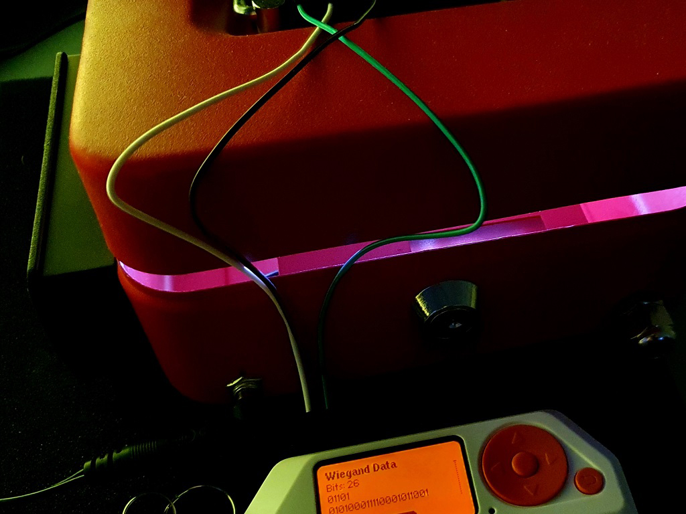
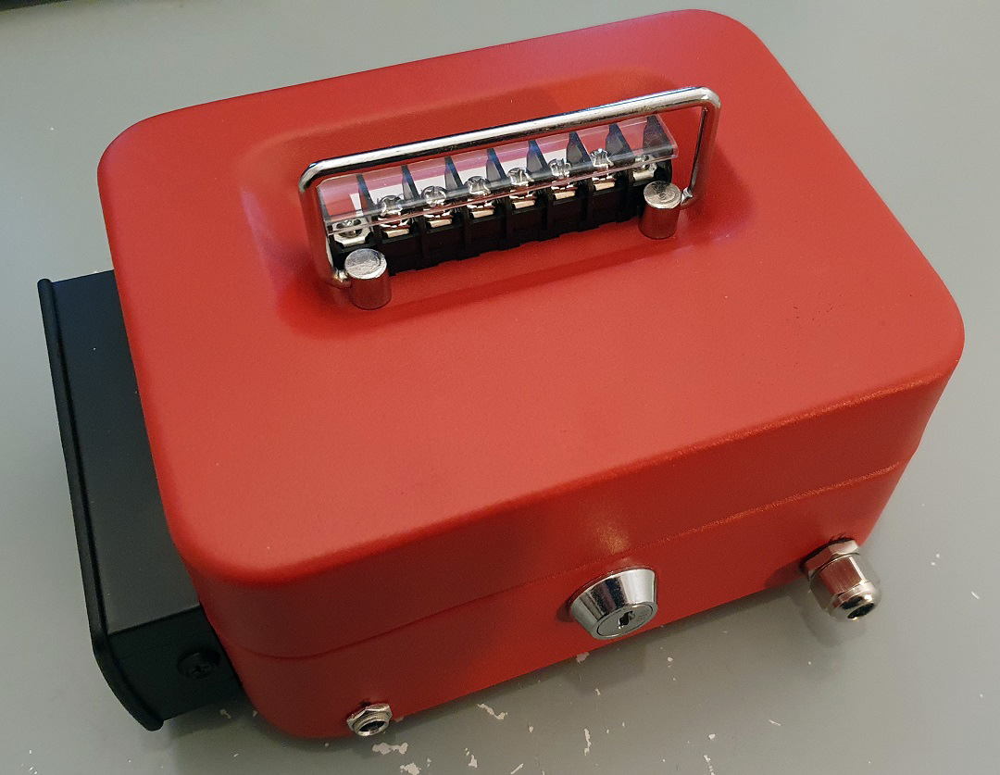
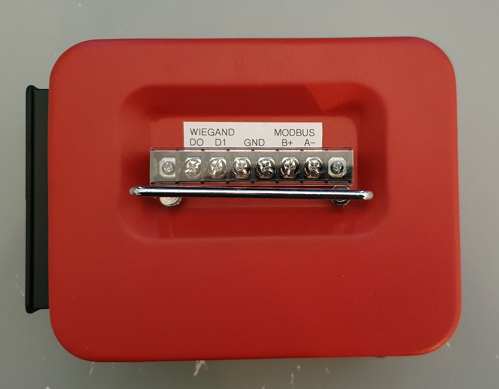
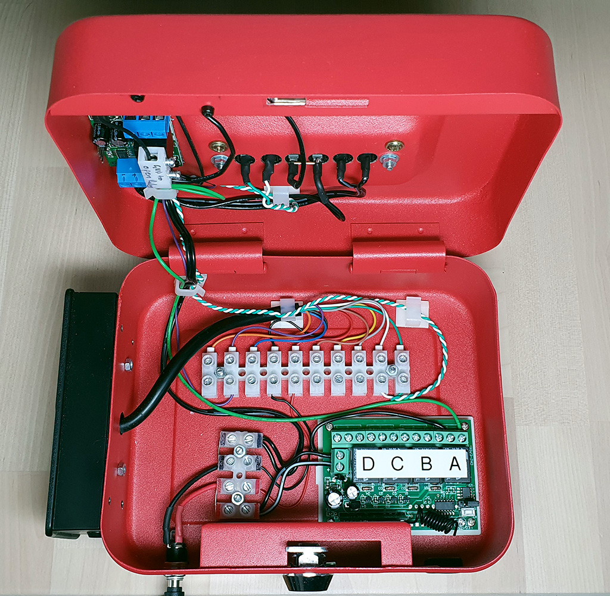

# Physical Access Control Systems lab

Taking some of the PACS hardware from the [IT/OT Hack
Lab](https://github.com/thisismyrobot/IT-OT-hack-lab) to make a PACS training
lab. This will be based around [the red
box](https://github.com/thisismyrobot/IT-OT-hack-lab/blob/df48e1e9c3eb5dedd9a71def0c8c5bff6352a379/img/lab.jpg)
from the earliest iteration of that lab.

## In action

## Bulid

## Training areas

 - Wiegand sniffing, replay, injection
 - RFID fob cloning
 - IR sniffing, replay, injection (the RFID reader can be programmed with IR)
 - Modbus injection
 - Wafer lock picking (not hard...)

## Hardware

 - Simple red cash box, with a solenoid installed to allow opening electronically.
 - Modbus relay controller
 - TECHview LA-5351 RFID Access Card Reader
